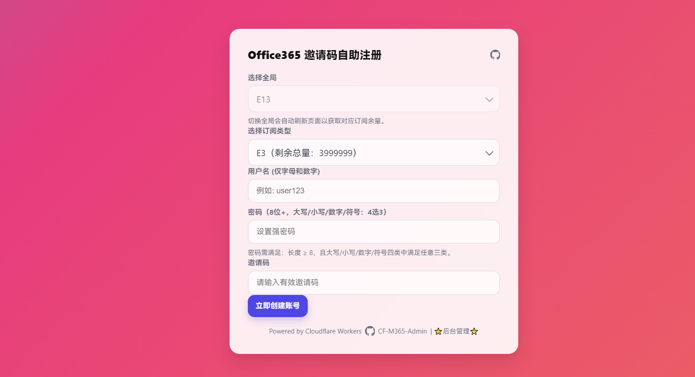
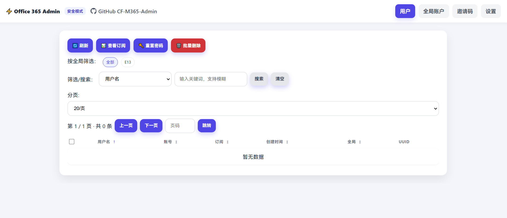

# CF-M365-Admin

一个面向社区用户与中小团队的 **Microsoft 365（Office 365）账号自助开通与轻量管理面板**，基于 **Cloudflare Workers + Microsoft Graph API** 实现。  
无需服务器、开箱即用，适合用于：测试租户管理、账号发放、内部自助开通、演示环境等。

> 友情提醒：该项目是技术工具，不是“账号分发服务”。部署与使用者需自行确保合规（详见文末免责声明）。

---

## 📸 截图 / 演示

### 示例 1：主界面 / 功能演示

*图注：这里是给用户展示的默认首页示例（邀请码注册界面）。

### 示例 2：后台界面 / 管理展示

*图注：这里是管理端示例，用于管理已有用户、全局、邀请码等功能。

---

## ✨ 主要特性（新版本）

### ✅ 前台（用户侧）
- 自助注册创建 Microsoft 365 用户
- 订阅类型展示“剩余数量”，例如：`E1（剩余总量：200）`
- 订阅下拉列表按“剩余数量”自动排序（余量最多默认在最上）
- **密码规则**：大写 / 小写 / 数字 / 符号 **4 选 3**，且长度 ≥ 8  
  - 前端实时校验，不符合则红字提示并禁止提交（节省云端资源）
- **禁止注册敏感用户名**（local-part 级别，例如 `admin` / `root`）  
  - 命中时直接拒绝，并弹出强调色的强提示弹窗（“该用户名被禁止注册！请勿尝试注册非法用户名！”）
- 全站移动端适配：不出现页面横向滚动、表格溢出、弹窗超宽等问题

### ✅ 后台（管理侧）
- 自定义后台路径（避免被扫）
- 管理员 **用户名 + 密码** 登录（Session Cookie）
- 全局（Tenant）管理：Tenant / Client / Secret / 域名 / SKU 映射
- “点我获取 SKU”：填写 TenantId/ClientId/ClientSecret 后即可点（无需先保存）
- 用户管理：搜索/分页/排序、批量重置密码、批量删除
- 邀请码：生成/导出/删除、可限制可用全局+订阅、限制次数
- 订阅查看：显示总量/已用/剩余；如权限允许，显示订阅到期时间（生命周期时间）
- **额外保护账户**：统一改为“禁止注册用户名”（英文逗号分隔），并默认内置一组敏感名称，降低首次部署风险
- 受保护用户名对应账号：**禁止通过面板/API 删除**（防误删、防恶意）

---

## 🧩 新旧版本区别 & 迁移指南（必读）

> 本区域专门说明：你从旧版升级到新版本会遇到哪些变化，如何迁移最省事。

### 1) 配置方式变化（旧版：环境变量为主 → 新版：KV 配置为主）
旧版通常通过 Workers 环境变量配置 `AZURE_TENANT_ID / AZURE_CLIENT_ID / AZURE_CLIENT_SECRET / DEFAULT_DOMAIN / ADMIN_TOKEN / SKU_MAP ...`  
新版本引入 **安装向导 + KV 持久化配置**（更适合多全局、多邀请码、多设置场景），并在后台维护全局与 SKU 映射。

**迁移建议：**
- 若你之前只维护一个租户：升级后在后台「全局管理」新建 1 个全局，把旧环境变量对应内容填进去即可。
- 若你旧版依赖 `SKU_MAP`：升级后可用“点我获取 SKU”重新拉取，然后用后台生成/维护 SKU Map（不再需要把大段 JSON 塞在环境变量里）。

### 2) 后台鉴权变化（旧版：token 查询参数 → 新版：用户名+密码登录）
旧版后台一般是：`/admin?token=你的ADMIN_TOKEN`  
新版本是：`/admin/login` 输入 **管理员用户名 + 密码**，并使用 Cookie Session。

**迁移建议：**
- 升级后首次访问会进入安装向导，按提示设置管理员账号与后台路径。
- 若你习惯“只要链接就能进后台”：建议搭配 Cloudflare Access / WAF 来做更强的后台访问控制（更安全也更专业）。

### 3) 保护策略变化（旧版：完整邮箱保护 HIDDEN_USER → 新版：禁止注册用户名 local-part）
旧版 `HIDDEN_USER` 以“完整邮箱匹配”为主，用于隐藏/防删特权账号  
新版本统一改为 **禁止注册用户名**（local-part，例如 `admin`），并默认内置敏感名单，避免“第一次部署没设防护，被人抢注 admin”。

**迁移建议：**
- 如果你原本依赖“保护某个完整邮箱”：请把其 `@` 前的用户名加入“额额外保护账户”里（例如 `admin@xxx.onmicrosoft.com` → 填 `admin`）。
- 如果你有多个域的同名管理员账号，新策略反而更省心（所有 `admin@*` 都会被保护）。

### 4) 前台订阅展示变化（旧版：仅显示类型 → 新版：显示余量并排序）
旧版强调可通过 SKU 映射隐藏真实 ID、并可查询订阅余量  
新版本在首页直接显示“剩余总量”，并将余量最多的置顶，降低误选与咨询成本。

**迁移建议：**
- 如果你不想在前台暴露余量：你可以保留“只显示订阅名”的样式（需要你自行改 UI 文案）。当前版本的实现是“服务端渲染+不暴露后台 API”，已尽量兼顾安全。

### 5) 移动端体验变化（旧版：表格/弹窗容易溢出 → 新版：强制响应式）
新版本对：用户页列表、订阅弹窗、所有 modal、工具栏/分页区域做了移动端压缩与卡片化，避免横向滚动。

---

## 🛠️ 部署前提（保持与旧版一致）

你需要准备（与旧版一致）：  
1. **Cloudflare 账号**：用于部署 Workers、配置 KV/变量  
2. **Microsoft 365 全局管理员权限**：用于注册 Azure AD 应用  
3. **Azure AD 应用（App Registration）**：
   - 获取 `Client ID`、`Tenant ID`
   - 创建 `Client Secret`（注意使用 Value，不是 Secret ID）  
   - 配置 Graph API 权限（Application permissions），并执行管理员同意（Admin consent）  

> 建议最小权限起步：`User.ReadWrite.All`；若你需要展示订阅到期时间，通常还需要 `Directory.Read.All` 或 `Organization.Read.All`（按你的租户策略为准）。

---

## ⚙️ Cloudflare Workers 部署（新版本）

### 1）创建 KV
Workers → KV → Create namespace  
建议命名：
- `CONFIG_KV`

### 2）创建 / 更新 Worker
将新版本脚本粘贴到 Worker 编辑器中并部署。

### 3）绑定 KV
Worker Settings → Bindings  
- KV namespace bindings：
  - `CONFIG_KV` → 选择你的 KV

### 4）可选：环境变量（高级用法）
- `HIDDEN_USER`：可选“静默保护”名单（英文逗号分隔，仅匹配用户名 @ 前缀）  
  - 例：`admin,root,superadmin`  
  - 适合放置最关键的用户名（无法在后台误改）

> 旧版大量依赖环境变量（如 `SKU_MAP`、`ADMIN_TOKEN` 等）  
> 新版本推荐通过安装向导和后台设置完成配置，环境变量仅作为“更强硬的兜底保护”。

---

## 🚀 快速开始（从 0 到可用）

1. 部署 Worker 并绑定 `CONFIG_KV`
2. 访问你的 Worker 域名，进入安装向导
3. 设置：
   - 管理员用户名
   - 管理员密码
   - 后台路径（例如 `/admin` 或 `/console`）
4. 进入后台 → 新建全局（Tenant），填写 Tenant/Client/Secret/默认域
5. 点击“点我获取 SKU”，生成 SKU Map
6. （可选）开启邀请码模式并生成邀请码
7. 回到首页测试注册流程（建议用手机也测一遍）

---

## 📖 使用指南

### 用户端
访问你的 Worker 主页：
- 选择订阅（会显示剩余量并排序）
- 输入用户名、密码（4 选 3 规则）
- 若用户名被保护，会被强提示拒绝注册

### 管理端
访问：
- `https://你的域名/{adminPath}/login`

在后台可进行：
- 全局管理、用户管理、邀请码管理、设置与安全策略调整

---

## 🧯 排错建议（Troubleshooting）

- **后台 404 / 进不去**：大概率是你修改了后台路径，请使用新的路径访问
- **“点我获取 SKU”不可点**：先确认 TenantId / ClientId / ClientSecret 三项已填写
- **订阅到期时间不显示**：通常是权限不足，检查 Graph 权限并确认已 Admin consent
- **前台显示余量不更新**：切换全局会触发服务端刷新；若仍异常请检查租户接口权限与网络连通

---

## ⚠️ 免责声明

本项目以开源形式提供，仅作为技术参考与管理工具使用。部署者/使用者应确保其使用方式符合所在地法律法规以及 Microsoft、Cloudflare 等服务提供方的条款与政策。  
作者与贡献者不对因使用、误用或滥用本项目造成的任何直接或间接损失承担责任，包括但不限于账号封禁、租户限制、服务中断、数据丢失、许可/合规风险与法律责任。  
如你正在将其用于组织/商业环境，建议在上线前进行安全评估、权限最小化配置，并启用额外的访问控制（如 Cloudflare Access）。

---

## License

MIT License
